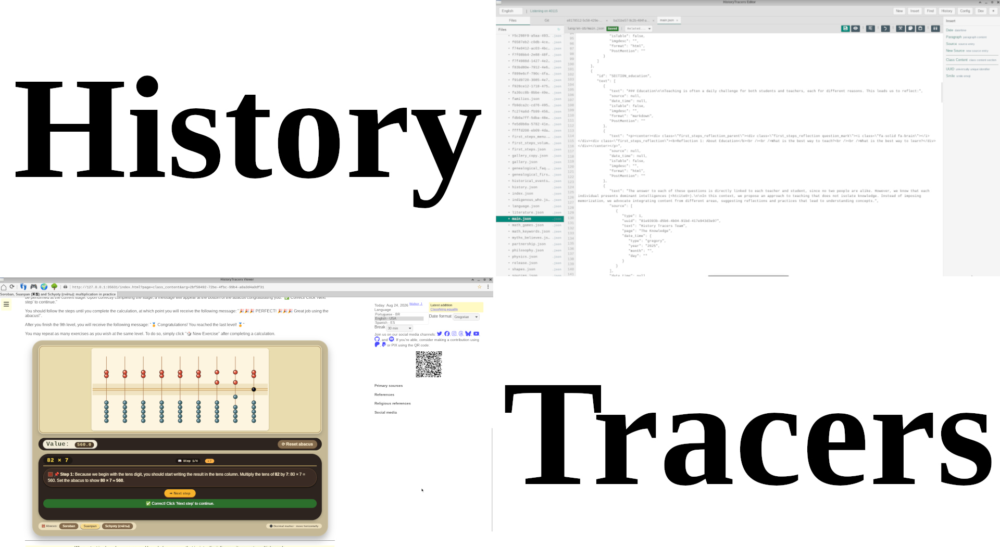

[](CODE_OF_CONDUCT.md)


## What is History Tracers?

This project is free software distributed under the `GPL 3 or later` license. All content on the project is licensed under [CC BY-NC 4.0 DEED](https://creativecommons.org/licenses/by-nc/4.0/), unless otherwise indicated.

**History Tracers** is more than an educational website — it is a learning ecosystem built for everyone. Whether you are a student eager to understand, a teacher looking for new ways to explain, or simply a curious mind, this project was made for you. All content is free, available in multiple languages, and designed so that **when you understand *why* something works, you never forget *how* it works.**

<p align="center">
  
  <br />
  <em>The History Tracers Viewer and Editor — free software tools built so that everyone can learn and teach.</em>
</p>

The image above shows the two software applications at the heart of this project: the **Viewer** and the **Editor**. The Viewer is your gateway to knowledge — it lets you browse lessons, view images, listen to audio narrations, and explore interactive content. The Editor is your gateway to contribution — it provides a simple interface to write new texts, add sources, and publish educational content in multiple languages. Together, they form a complete learning ecosystem: **one side teaches, the other learns, and both are free for everyone.**

## Why Another Educational Project?

Teaching is often a daily challenge for both students and teachers, each for different reasons. Our goal is to support both sides of the learning process by providing diverse tools that make knowledge accessible, engaging, and personal.

### The Main Tool

Unsurprisingly, the main teaching tool in *History Tracers* is **YOU**. Through our own body, we study different sciences. Your hands, your fingers, your steps — they are all instruments of learning.

### Texts with Audio

With the exception of two sections that will soon receive audio (*General History* and *Historical Events*), all project texts already include narration. This way, in addition to reading and practicing, you can also listen to the content whenever you like — on the bus, during a walk, or before sleep.

### Images

Purely written texts may be challenging for some people. For this reason, we present illustrated content whenever necessary. A single image can replace a thousand words of explanation.

### Genealogy

Family relationships play an important role in education, as they make knowledge literally become part of our lives. When you see your own family tree connected to the history of numbers, mathematics stops being abstract — it becomes personal.

### Practices

Theoretical teaching is important, but science without practice is not science. For this reason, most texts include, at the end, questions with answers so you can check whether you understood the content. In addition, some texts include practices that can be carried out at home. **Try it now — learning by doing is the deepest kind of learning.**

### Multidisciplinarity

The word that names this section is long and equally deep. It highlights the need for content from different disciplines to be presented together. For this reason, the same text from *History Tracers* may appear in different sections. **Knowledge does not live in isolated boxes — it connects, just like the branches of a tree.**

### Videos

In some texts, we also present videos to further illustrate the content, bringing history and science to life through sight and sound.

## Why Can't I Access the Site Locally?

Our project is designed to minimize page reloads and does not consolidate all its code into a single file. Consequently, attempting to open the `index.html` file locally triggers the need to load additional JavaScript files, resulting in your browser interpreting it as a [CORS request](https://developer.mozilla.org/en-US/docs/Web/HTTP/CORS/Errors/CORSRequestNotHttp?utm_source=devtools&utm_medium=firefox-cors-errors&utm_campaign=default), and blocking access.

To enable local access to the content, we have developed a simple web server using [GO](https://go.dev/). After installing GO on your host machine, you can execute the following command:

```sh
$ go run src/history_tracers.go
Listening Port 12345 without devmode content /
```

Once you've completed these steps, you can open your web browser and navigate to `http://localhost:12345`.

## Adding a New Language

To incorporate a new language into the project, begin by creating a directory. Subsequently, execute a script that automatically generates all necessary files for the new language:

```sh
$ mkdir lang/es-ES
$ cd scripts
$ bash create_language.sh --path "es-ES" --msg "Aguardando tradução"
```

Lastly, you can incorporate content in another language. It's advisable to commence by handling files whose names do not follow the [Universal Unique Identifier](https://developer.mozilla.org/en-US/docs/Glossary/UUID) format.

## Sources

The `lang/sources/` directory contains JSON files with the sources referenced in each content file. Each content file references a corresponding sources file in the `lang/sources/` directory, where source citations are categorized into:

- **primary_sources**: Primary historical or academic sources
- **reference_sources**: Reference materials and secondary sources
- **religious_sources**: Religious texts and documents
- **social_media_sources**: Social media references

## How to Compile *History Tracers*

*History Tracers* uses **GNU Make** as its build system.

### Initial Setup (first time only)

If this is a fresh clone, first initialize the project submodule:

```sh
git submodule update --init
```

Then generate the build system files:

```sh
./bootstrap
```

This runs `autoreconf` to generate the configure script and other required files.

### Configuration

After running bootstrap (or if you have an existing configure script), run `./configure` to set up the build environment. This script allows you to customize installation paths and compiler options:

```sh
$ ./configure [OPTIONS]
```

Available options:

- `--prefix=PREFIX` - Installation prefix directory [/usr]
- `--with-go-compiler=COMPILER` - Specify Go compiler (go, gccgo, or full path) [auto]
- `--with-conf-path=PATH` - Configuration file path [/etc/historytracers/historytracers.conf]
- `--with-src-path=PATH` - Source directory path [/var/www/htdocs/historytracers/]
- `--with-content-path=PATH` - Content directory path [/usr/share/historytracers/www/]
- `--with-log-path=PATH` - Log directory path [/var/log/historytracers/]
- `--help` - Display all available options

For a complete list of options, run:
```sh
$ ./configure --help
```

### Build Commands

```sh
$ make                    # Build publisher, editor, and viewer
$ make all                # Alias for make
$ make publisher          # Build only the publisher
$ make editor             # Build only the editor
$ make dev                # Development build (no optimization flags)
$ make prod               # Production build (with optimization)
```

### Compiling on Windows

The project can be compiled on Windows using either the GNU Autotools (like on Linux) or directly with Go.

#### Option 1: Using Go directly

```powershell
cd src\publisher
go build -o historytracers-publisher.exe .

cd ..\editor
```

**Note:** The editor requires CGO to be enabled (Fyne GUI framework needs OpenGL).

On Windows, run:
```powershell
$env:CGO_ENABLED = "1"
go build -o historytracers-editor.exe .
```

Or permanently enable CGO:
```powershell
[System.Environment]::SetEnvironmentVariable("CGO_ENABLED", "1", "User")
go build -o historytracers-editor.exe .
```

Make sure gcc is in PATH (install with MSYS2: `pacman -S mingw-w64-x86_64-toolchain`)

#### Option 2: Using Autotools (requires MSYS2 or similar)

```sh
./configure
make
```

On Windows, the configure script automatically sets appropriate default paths:
- Configuration: `C:\ProgramData\historytracers\historytracers.conf`
- Content: `C:\inetpub\wwwroot\historytracers\`
- Logs: `C:\ProgramData\historytracers\log\`

### Batch Processing

The publisher CLI tool processes content generation tasks (minify, audio, GEDCOM, etc.). Run with `--help` to see available flags.

### Testing

```sh
make test                 # Run all tests in src/publisher, src/viewer and the JavaScript unit tests; src/editor tests run only when BUILD_EDITOR is enabled
```

The `test` target also runs the JavaScript unit tests (`src/js/test_ht_math.js`) with
Node.js's built-in test runner (`node --test`). Node.js >= 20 is required; install it
before running `make test` (e.g. `dnf install nodejs` on Fedora, `apt install nodejs`
on Debian/Ubuntu, or see `packaging/historytracers-install-requirements.sh`).

To run a single test:

```sh
$ cd src/publisher && go test -run TestFunctionName ./...
$ cd src/editor && go test -run TestFunctionName ./...
```

### Code Quality

```sh
$ make fmt                # Format all Go code (go fmt)
```

Manual formatting:

```sh
$ cd src/publisher && go fmt ./...
$ cd src/editor && go fmt ./...
```

### Dependency Management

```sh
$ make deps               # Install dependencies
$ make update-deps        # Update all dependencies
```

### Installation & Cleanup

```sh
$ make install            # Install binaries to system
$ make clean              # Remove build artifacts
```


To simplify the process, we’ve added the script `ht2pkg.sh`, which automatically runs all the steps required to generate the packages:

```sh
$ ./ht2pkg.sh
```

> **Editor Status:** The History Tracers Editor is currently in development and is **not included** in the generated packages by default. To build and use the editor, run `./historytracers-installer.sh`.

